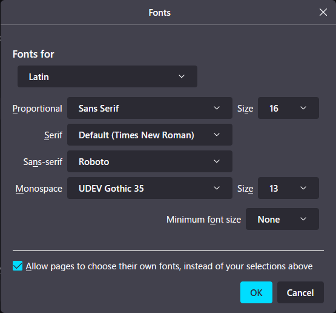
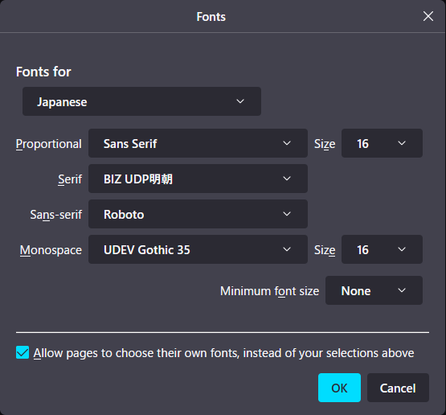

# Welcome!

Here I put some of stylesheets that I always use for browsing the Internet since I really stick to how specific fonts should be applied, or how they look in a certain websites. If your thought are as alike as mine, why don't you start using them?

Btw, I recommend you to use Stylus for Userstyles manager and applier, which is the browser extension available for both Firefox and Chromium Browser.

## Config Examples for `destroy_meiryo.css`

Let me show the best font settings for the stylesheets in this repository to be applied properly in your browser. These screenshots was taken in Firefox, but other browser such as Edge or Chrome should have a similar configration as well.

### Latin characters 

This font family setting works well for websites especially in English. Note that Roboto is the dominant font, and then other fonts come after the font. 

### Japanese chars 

This font family setting works well for websites especially in Japanese. Be sure that Roboto comes first as a sans-serif font, and then others come later.  

